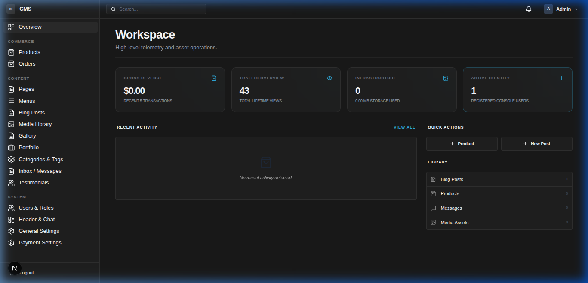
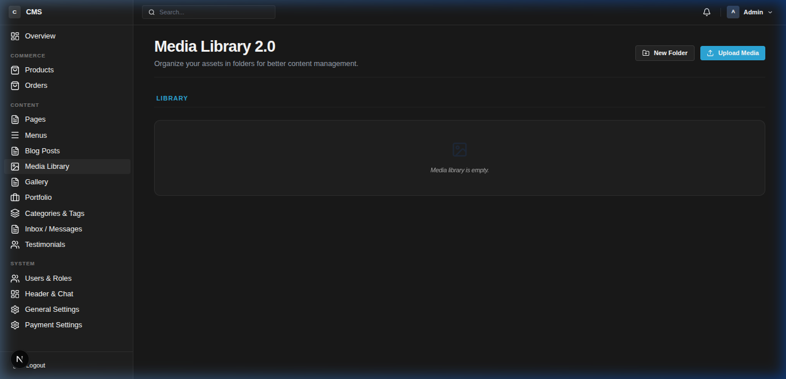
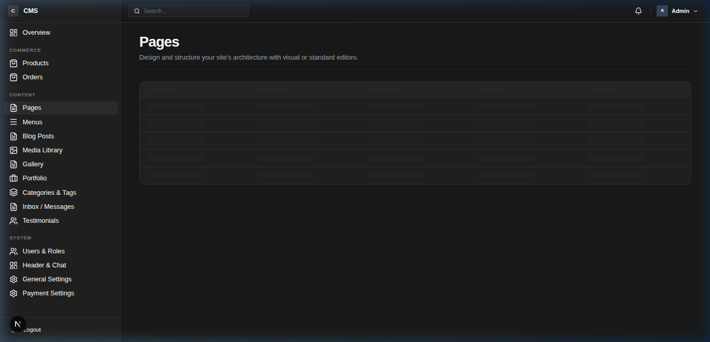
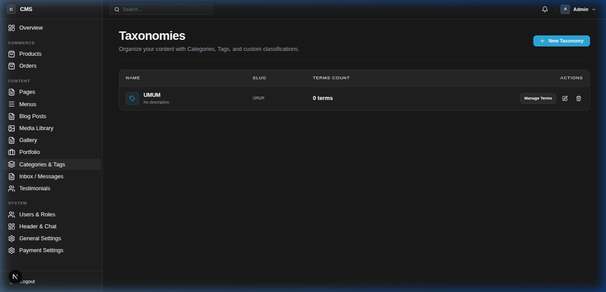
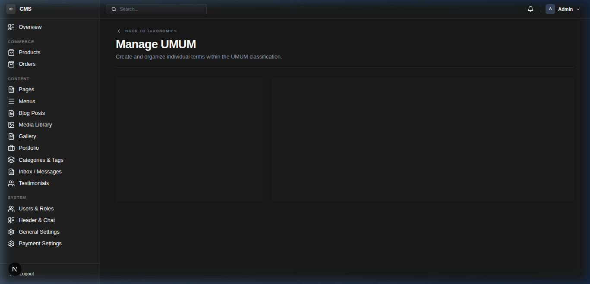
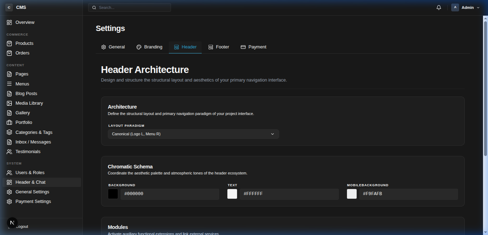

# Next CMS

<p align="center">
  <a href="README.md">English</a> | <a href="README.id.md">Bahasa Indonesia</a>
</p>

A powerful Next.js application for building and managing content with CredBuild. Featuring a **Universal Adaptive Installer**, Next CMS works seamlessly across Vercel, VPS, and Docker environments.

## Features

- **Adaptive Installer**: Smart environment detection for effortless setup on any platform.
- **Page Builder**: Visual editing with CredBuild.
- **Content Management**: Robust dashboard for pages, posts, and media.
- **SEO Optimized**: Dynamic Sitemap, Robots.txt, and metadata.
- **Modern Stack**: Built with Next.js 15, Prisma ORM, and Tailwind CSS.
- **Luxury Dark Studio**: Premium dashboard UI with high-density compact design.

## Previews

| Dashboard Overview | Media Library (Folder Based) |
| :---: | :---: |
|  |  |

| Content Management | Taxonomy Dashboard |
| :---: | :---: |
|  |  |

| Terms Management | Settings & Compact UI |
| :---: | :---: |
|  |  |

## Getting Started

### Prerequisites

- Node.js 18+
- PostgreSQL Database
- Cloudflare R2 (for primary storage)

### Installation & Setup

1.  **Clone the repository**:
    ```bash
    git clone https://github.com/crediblemark-official/Next_CMS.git
    cd Next_CMS
    ```

2.  **Install dependencies**:
    ```bash
    bun install
    ```

3.  **Deploy & Initialize**:
    For local development:
    ```bash
    npx prisma db push
    bun dev
    ```
    Then visit `http://localhost:3000/installer` to initialize your site.

    For **Cloud Deployment (Vercel/Railway)**, please refer to the [Deployment Guide](docs/DEPLOYMENT.md).

## Documentation

- [Installation Guide](docs/INSTALLATION.md) - Deep dive into local and cloud setup.
- [Deployment Guide](docs/DEPLOYMENT.md) - Platform-specific instructions.
- [Developer Guide](docs/creating-hero-components.md) - Creating custom components.
- [Security Analysis](docs/security-analysis.md) - Architecture security overview.

## Default Credentials
*Only available after running the installer or seeding scripts.*

| Role | Email | Password |
| :--- | :--- | :--- |
| **Admin** | `admin@univedpress.com` | `admin` |

> **Note**: Seed users can be created via `bun scripts/seed-user.ts`.

## License & Author
- **Author**: Rasyiqi Crediblemark
- **Homepage**: [build.crediblemark.com](https://build.crediblemark.com)
